# Database reconfiguration approach

## Initial snapshot

Groa gives movie recommendations based on user ratings and reviews. The ratings and the reviews are added in the database either from Letterboxd or IMDb. A user can also add his reviews and ratings directly on the platform.

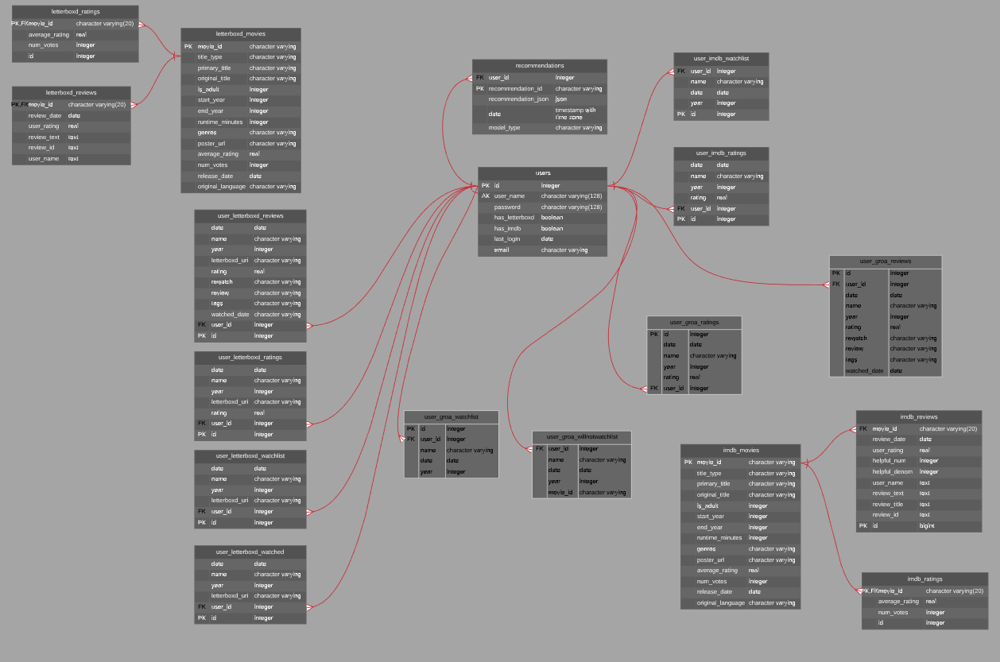

### Why to reconfigure the database
There are several reasons why the database had to be reconfigured: 

**1. Redundancy**

  * `letterboxd_ratings` table contains the same information already presented in `letterboxd_movies` table. Idem `imdb_ratings` contains the information already presented in `imdb_movies` table;
  * Two tables contain information about movies: `letterboxd_movies` and `imdb_movies`;
  * Two tables contain movie reviews: `letterboxd_reviews` and `groa_reviews`;
  * Two tables contain user reviews: `user_letterboxd_reviews` and `user_groa_reviews`;
  * Three tables contain user ratings: `user_letterboxd_ratings`, `user_groa_ratings`, and `user_imdb_ratings`;
  * Three tables contain user watchlist: `user_letterboxd_watchlist`, `user_groa_watchlist`, and `user_imdb_watchlist`

**2. Values are not atomic**

  The recommendations are stored in the `recommendation_json` column of the `recommendations` table. The column's data type is JSON, and it stores information about title, year, genres, poster_url, as well as model metrics.

**3. Entity integrity violated**

  `user_groa_willnotwatchlist` does not have a primary key or a unique constraint, allowing the existence of duplicate rows.

**4. Missing relationships**

  All tables with the `user_%` format contain information related to movies (`name` and `year`), but there is no attribute to refer to the tables containing detailed information about those movies. 

## The new Database Schema
The existing database did not have the properties of a Relational Database. Thereupon, it was reconfigured following the RDBMS rules. As a result, the new database has atomic values, non-redundant data, and it follows both the entity integrity and referential integrity. The table names, attributes, column data types, as well as the relationships between tables, are presented in the following schema.

**Acronyms:**
- **PK**: Primary Key
- **FK**: Foreign Key
- **AK**: Alternative Key

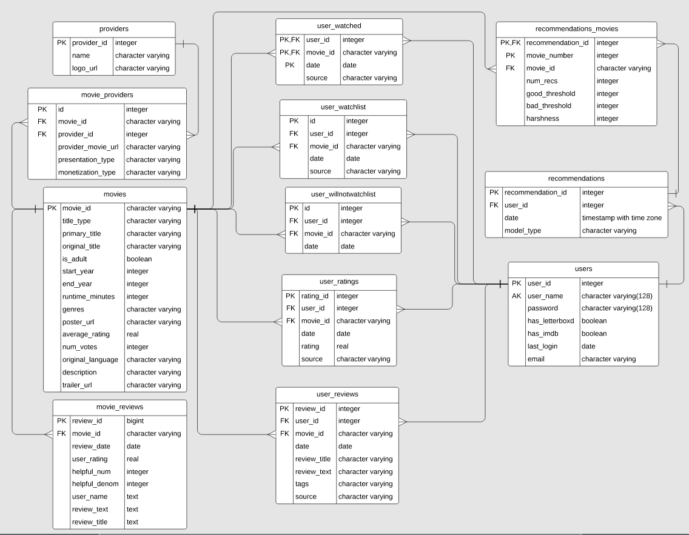

Find [here](https://www.lucidchart.com/invitations/accept/7b6ed3b9-2387-4c66-a93e-31ce3b1346b6) the editable version of the schema.

### The process

1. Delete tables `letterboxd_ratings` and `imdb_ratings`.
2. Merge `letterboxd_movies` and `imdb_movies` in a new table: `movies`.

  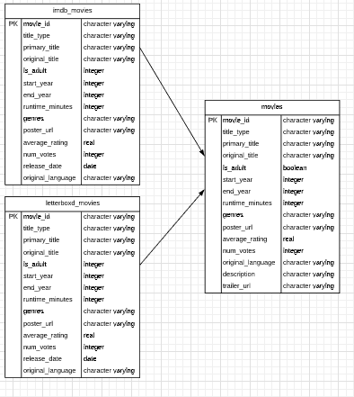

3. Merge `letterboxd_reviews` and `imdb_reviews` in a new table - `movie_reviews`.

  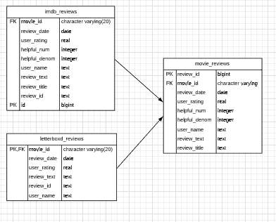

4. The structure of the table `users` remains the same, except for the primary key, which was renamed from `id` to `user_id`.

  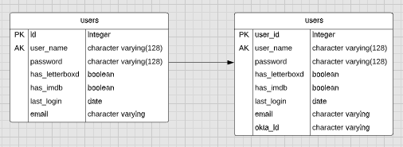

5. The data from `user_letterboxd_watched` was imported into the new table `user_watched`, where a movie_id is assigned to each row, instead of `name` and `year`.

  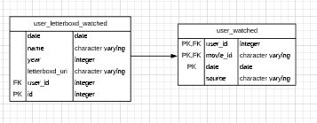

6. The data from `user_letterboxd_watchlist`, `user_groa_watchlist`, and `user_imdb_watchlist` is stored into a new table called `user_watchlist`. Each row has a movie_id assigned, based on the name and year of the movie.

  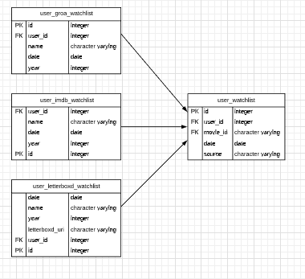

7. The table `user_groa_willnotwatchlist` becomes `user_willnotwatchlist`, where each row has a movie_id assigned, based on the name and year of the movie.

  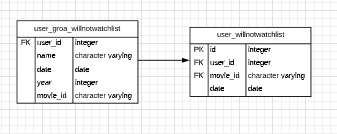

8. The data from `user_letterboxd_ratings`, `user_groa_ratings`, and `user_imdb_ratings` is stored into a new table called `user_ratings`. Each row has a movie_id assigned, based on the name and year of the movie.

  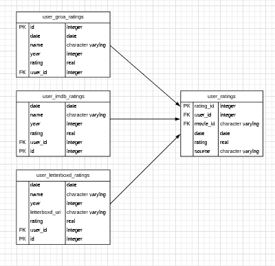

9. The data from `user_letterboxd_reviews` and `user_groa_reviews` is stored into a new table called `user_reviews`. Each row has a movie_id assigned, based on the name and year of the movie.

  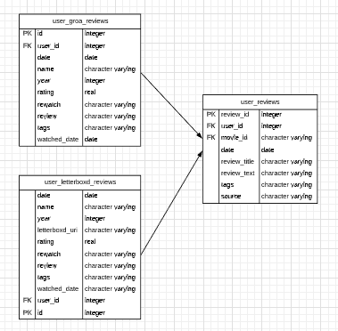

10. The `recommendation_json` column of the `recommendations` table is transformed into a separate table, storing only the `movie_id` and the metrics of the model.

  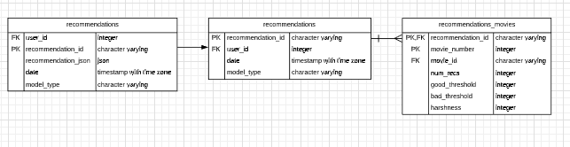

11. The values for the following columns are autogenerated:

| Table                 | Column            | Usage                            |
| --------------------- | ----------------- | -------------------------------- |
| movie_reviews         | review_id         | NEXTVAL('movie_review_id_seq')   |
| user_ratings          | rating_id         | NEXTVAL('user_rating_id_seq')    |
| user_reviews          | review_id         | NEXTVAL('user_review_id_seq')    |
| user_watchlist        | id                | NEXTVAL('user_watchlist_id_seq') |
| users                 | user_id           | NEXTVAL('users_id_seq')          |
| user_willnotwatchlist | id                | NEXTVAL('willnotwatch_id_seq')   |
| movie_lists           | list_id           | NEXTVAL('movie_lists_id_seq')    |
| movie_providers       | id                | NEXTVAL('movie_provider_id_seq') |
| providers             | provider_id       | NEXTVAL('provider_id_seq')       |
| recommendations       | recommendation_id | NEXTVAL('rec_id_seq')            |
