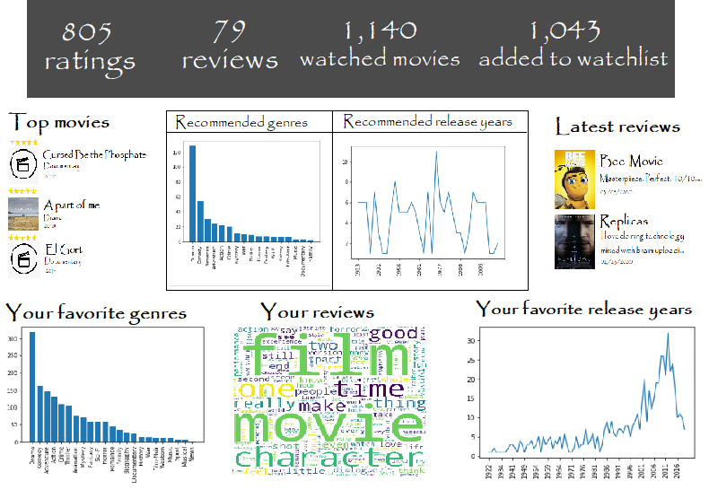

# API for Data Visualizations

## Installation

```
>conda create -n Visualizations python==3.7
>conda activate Visualizations
>pip install -r requirements.txt
```

## Local run

```
>python application.py
```

## Routes

| Graph data | Route |
| - | - |
| All graphs data | /get_all_graphs/user_id |
| Header | /get_header/user_id |
| Best rated movies | /get_best_rated |
| Latest reviews | /get_last_reviews |
| Favorite genres | /get_favorite_genres/user_id |
| Wordcloud | /get_common_words/user_id |
| Favorite years | /get_favorite_years/user_id |
| Recommended genres | /get_recommended_genres/user_id |
| Recommended years | /get_recommended_years/user_id |
| -	| - |
| Chart favorite genres | /chart_favorite_genres/user_id |
| Chart favorite years | /chart_favorite_years/user_id |
| Chart recommended genres | /chart_recommended_genres/user_id |
| Chart recommended years | /chart_recommended_years/user_id |

## Dashboard prototype


